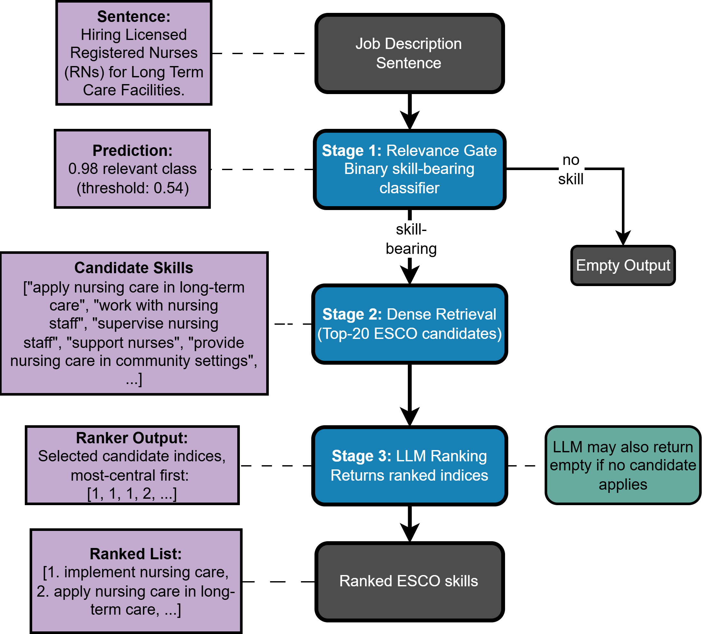

# LLM Skill-Ranking Pipeline

Evaluates skill-extraction pipelines on [SKILL-XL](https://huggingface.co/datasets/TechWolf/Skill-XL) in which an **LLM ranks retrieved ESCO skill candidates by relevance**. For every job-description sentence, a dense retriever proposes the top-N skills from the [ESCO](https://esco.ec.europa.eu/) taxonomy (~13.9k labels); an LLM then returns the candidates it judges genuinely expressed, **ordered most-to-least central, by candidate index** — so it can never hallucinate or paraphrase a taxonomy label. An optional binary relevance **gate** filters out no-skill sentences first, optionally refined by an LLM cascade on its uncertain band.



Because SKILL-XL grades each gold skill with a centrality `cluster` (1 = most central), rankings are scored with **graded NDCG** in addition to P/R/F1 and MAP — each in variants that separate retrieval ceiling, LLM ranking quality, and whole-population deployment value (details in [`summary.txt`](summary.txt), the full method reference).

---

## 1. Installation

```bash
git clone <this repo> && cd Ranking_Pipeline_Final
python -m venv .venv
.venv\Scripts\activate            # Windows   (source .venv/bin/activate on Linux/macOS)
pip install -r requirements.txt
```

**API keys** — only needed for OpenAI/Anthropic models; the default local model needs none:

```bash
cp API_keys.env.example API_keys.env    # then fill in the keys (file is git-ignored)
```

**LLM serving** — the default `qwen-local` registry entry expects a vLLM server:

```bash
vllm serve Qwen/Qwen3-14B-AWQ --port 8000
```

To use different models, edit `LLM_REGISTRY` in [`ranking_pipeline/config.py`](ranking_pipeline/config.py) — providers `openai_compat` (any OpenAI-compatible endpoint), `openai`, and `anthropic` are supported, with per-model concurrency and rate caps.

ESCO itself downloads automatically into a per-user cache on first run.

## 2. Quick start — zero-shot evaluation

```bash
python llm_ranking_pipeline.py \
    --retrievers Aleksandruz/skillmatch-mpnet-curriculum-retriever \
    --gate Aleksandruz/Binary-Relevance-RoBERTa --gate-llm-refine \
    --llms qwen-local \
    --dataset TechWolf/Skill-XL --split test \
    --llm-candidates 20 --k 5 10 \
    --output results/my_run.json --predictions-dir results/predictions/my_run
```

This scores five pipelines per retriever — retrieval@k (± gate), the retriever's own cosine ordering, retrieval→LLM, and gate→retrieval→LLM — and writes:

- **`--output`**: one JSON with the config, gate report, retriever diagnostics (MAP/Recall/MRR), and all metrics (micro P/R/F1 in `all` and `skill_bearing` regimes; NDCG@k and MAP@k in `end_to_end` / `given_candidates` / `deployment` variants).
- **`--predictions-dir`**: one JSON per pipeline with a per-sentence trace (gate score/decision, retrieved candidates with cosine scores, the LLM's ranking annotated with gold clusters) — use these for error analysis.

## 3. Few-shot evaluation

Demonstrations are mined from the validation split by a separate prep step (each demo must show the *complete* correct ranking for its own candidate list, so gold skills the retriever missed are injected first):

```bash
# 1. Build the demonstration pool for YOUR retriever (pools are retriever-specific!)
python prepare_ranking_fewshot.py \
    --retriever Aleksandruz/skillmatch-mpnet-curriculum-retriever \
    --dataset ./data/development.csv --llm-candidates 20 \
    --output data/ranking_fewshot_pool.json

# 2. Run with 3 ranking demos + 2 rejection demos
python llm_ranking_pipeline.py ... \
    --n-shot 3 --fewshot-no-gold-shots 2 \
    --fewshot-pool data/ranking_fewshot_pool.json
```

- `--n-shot {0,1,2,3,5}` — **ranking demos** (gold-bearing sentences with a real ordering to imitate).
- `--fewshot-no-gold-shots N` — **rejection demos** (no-skill sentences answered `{"ranked": []}`); teaches restraint on irrelevant sentences.
- `--fewshot-selection diverse|random` — `diverse` (default) picks demos deterministically (most cluster-diverse rankings; "hard" negatives); `random` samples with `--fewshot-seed`.

Pre-built pools for three retrievers ship in [`data/`](data/): `ranking_fewshot_pool.json` (mpnet-curriculum), `ranking_fewshot_pool_ConTeXT.json`, `ranking_fewshot_pool_jobbert_v3.json` — all top-20, built from `data/development.csv`.

## 4. Gate options

```bash
--gate <model>                # enable the binary relevance gate (plain thresholding)
--gate-threshold 0.54         # override the model-config threshold
--gate-llm-refine             # LLM cascade: audit the uncertain band [threshold, t-upper)
--gate-t-upper 0.90           # auto-accept above this probability
--gate-audit-llm qwen-local   # which registry LLM audits
```

The evaluation runs the ranking LLM on *all* sentences and derives gated pipelines by masking, so gated/ungated variants share one LLM pass and are exactly comparable.

## 5. Running the full experiment grid

[`run_experiments.py`](run_experiments.py) runs 9 few-shot configurations (+1 plain-gate reference) sequentially. Set `RETRIEVER` / `FEWSHOT_POOL` at the top of the script; outputs land in `results/<retriever>/<config>.json`, so switching retrievers never collides with finished runs:

```bash
python run_experiments.py --dry-run          # inspect commands first
python run_experiments.py                    # run everything missing (resumable)
python run_experiments.py --only fs_n3_ng2 --force
python run_experiments.py --plain-gate       # whole grid without LLM gate refinement
                                             # (separate <name>_plain files)
```

Follow-ups for the best config (cheap — LLM calls replay from cache):

```bash
# even 50/50 class prior (sensitivity to class balance)
python llm_ranking_pipeline.py <best flags> --data-even --data-even-seed 42 ...
# Qwen thinking mode (slow: fresh calls in a separate cache partition)
python llm_ranking_pipeline.py <best flags> --qwen-thinking --llm-max-tokens 2048 ...
```

## 6. Baselines

```bash
# Cosine-threshold selection (no LLM): keep candidates with cosine >= tau,
# tau tuned on the validation split. Also reports the implicit gate
# (sentence kept iff top-1 clears tau). Appears in the summary table as "cos-thresh".
python threshold_ranking_baseline.py --retriever <model> \
    --output results/<retriever>/cos_threshold.json

# LLM-as-gate (needs the LLM server): zero-shot, 3-shot, and the cascade's
# audit prompt applied to ALL sentences, plus the accept-all floor.
python gate_llm_baseline.py --llm qwen-local --output results/gate_baselines.json
```

## 7. Comparing results

```bash
python summarize_results.py results/<retriever>/*.json --csv results/summary.csv
python summarize_results.py "results/**/*.json"      # all retrievers in one table
python summarize_results.py ... --k 10               # NDCG/MAP@10 columns
python summarize_results.py ... --include-baselines  # add retrieval@k baseline rows
```

One markdown/CSV row per (run × retriever × LLM × pipeline); config labels (`zero`, `n3+ng2`, `+even42`, `+think`, `cos-thresh`) and the gate mode (`refined`/`plain`/`none`) are derived from each file's stored config, so files can be renamed freely.

## 8. Key arguments (main pipeline)

| Argument | Default | Meaning |
|---|---|---|
| `--retrievers` | (required) | One or more sentence-transformer models to compare |
| `--gate` | none | Binary relevance gate model (enables gated pipelines) |
| `--llms` | `local` | `local`, `all`, or explicit `LLM_REGISTRY` keys |
| `--llm-candidates` | 20 | Top-N retrieval candidates shown to the LLM |
| `--k` | `5 10` | k values for retrieval baselines and NDCG@k / MAP@k |
| `--max-cluster-tier` | 5 | Cluster mapped to the top NDCG grade (deeper clusters collapse to grade 1) |
| `--scoring` | `all` | Primary no-skill regime in console output (both stored) |
| `--dataset` / `--split` | `TechWolf/Skill-XL` / `test` | HF dataset name or local `.csv` path |
| `--data-even` / `--data-even-seed` | off / 0 | Downsample to a 50/50 gold/no-gold prior (seeded) |
| `--qwen-thinking` | off | Qwen3 thinking mode (pair with `--llm-max-tokens 2048+`) |
| `--output` / `--predictions-dir` | see `--help` | Aggregate results / per-sentence traces |

## 9. Caching & reproducibility

Two content-addressed disk caches make re-runs and re-scoring nearly free; both are safe to delete:

- **`.emb_cache/`** — skill-vocabulary embeddings, keyed by retriever + vocabulary content.
- **`.llm_cache/`** — every LLM decision, keyed by (prompt version, thinking variant, model, sentence, exact candidate list). The prompt version encodes all few-shot settings **plus a content fingerprint of the selected demonstrations**, so different prompt content can never collide — comparisons across few-shot settings, retrievers, LLMs, and gate configs are always clean. Caches store raw answers only; metrics are recomputed every run. If you edit a prompt in `ranking_pipeline/prompts.py`, bump its version string.

Everything else is deterministic: greedy decoding (temperature 0), seeded sampling and downsampling, deterministic demo selection.

## Repository layout

```
llm_ranking_pipeline.py          Main entry point: runs and scores all pipelines
prepare_ranking_fewshot.py       Builds the few-shot demonstration pool
run_experiments.py               Sequential driver for the experiment grid
summarize_results.py             Merges results JSONs into one comparison table
threshold_ranking_baseline.py    Cosine-threshold selection baseline (no LLM)
gate_llm_baseline.py             LLM-as-gate baselines (zero/3-shot/audit prompt)
ranking_pipeline/                The package all entry points build on
  config.py                        LLM registry + API keys   <-- edit models here
  esco.py / data.py / retrieval.py Data, vocabulary, dense retrieval
  gate.py / prompts.py / fewshot.py / llm_clients.py
  metrics.py / reporting.py
data/                            SKILL-XL validation split + pre-built few-shot pools
results/                         Aggregate experiment results (traces git-ignored)
notes/                           Working analysis notes
summary.txt                      Full method description (reference for the paper)
```

## Data note

`data/development.csv` and the few-shot pools derive from [TechWolf/Skill-XL](https://huggingface.co/datasets/TechWolf/Skill-XL); ESCO labels are © European Union (ESCO v1.1.0), downloaded automatically from the official API.
